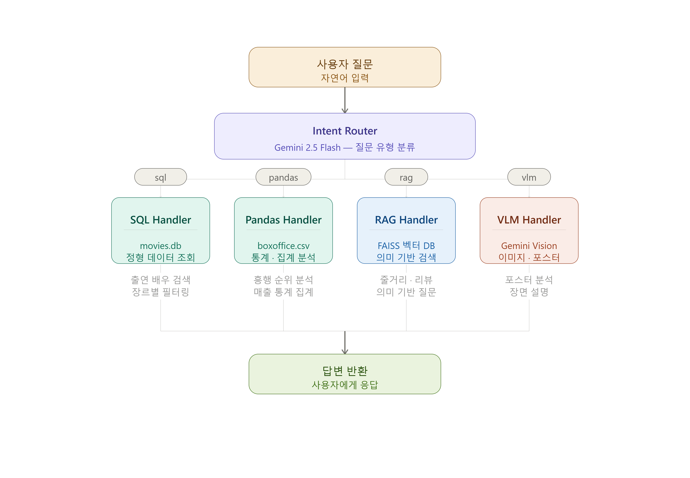
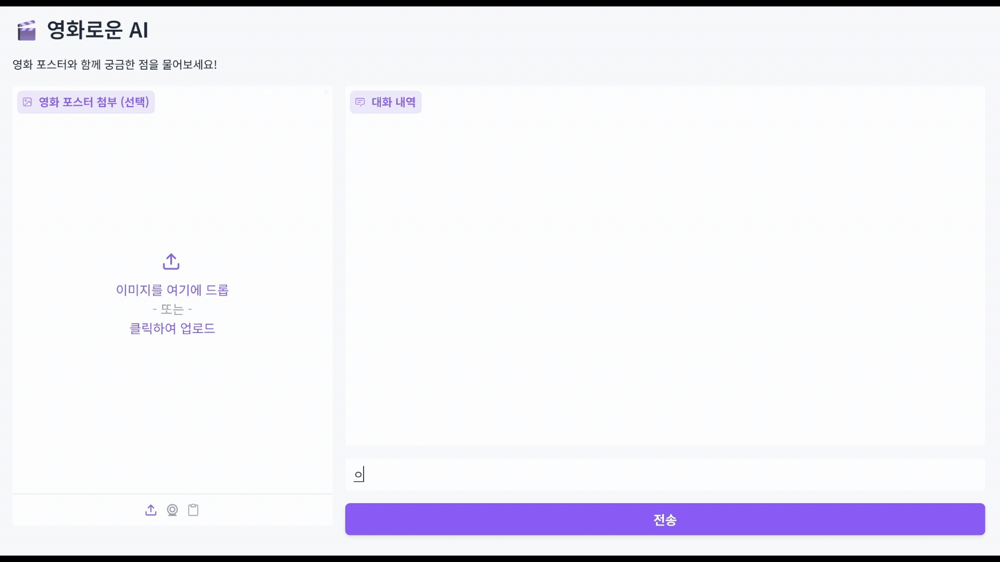
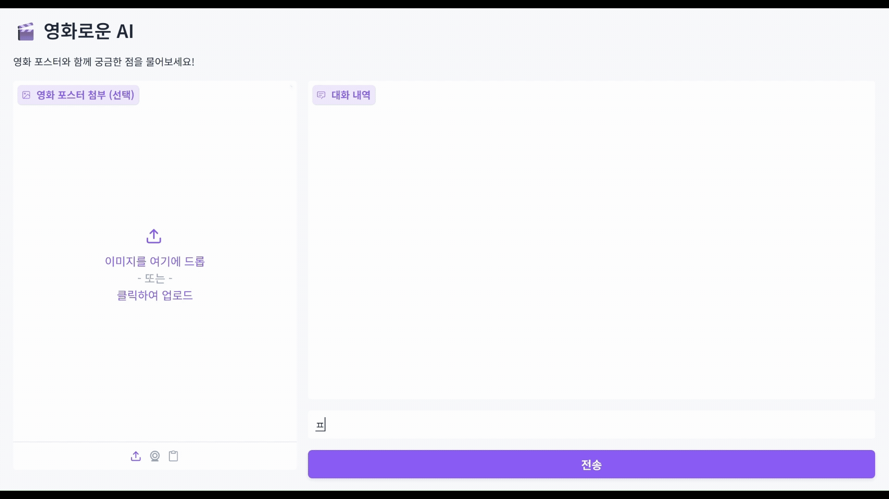
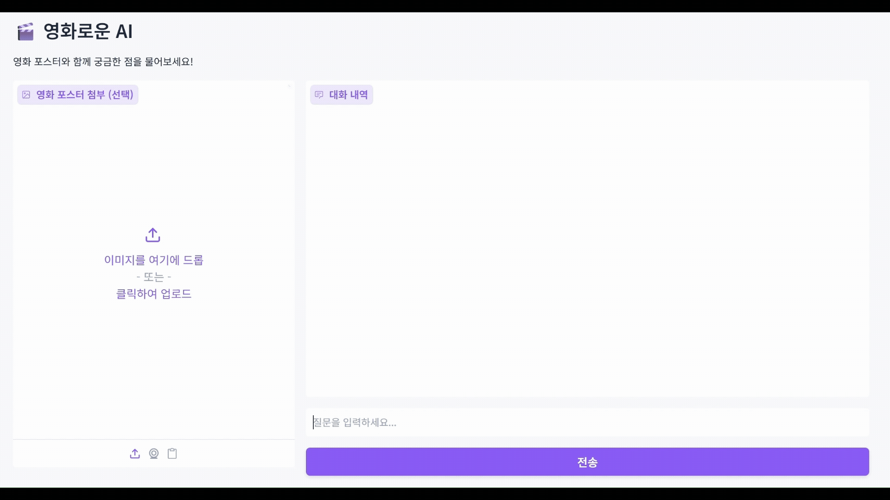
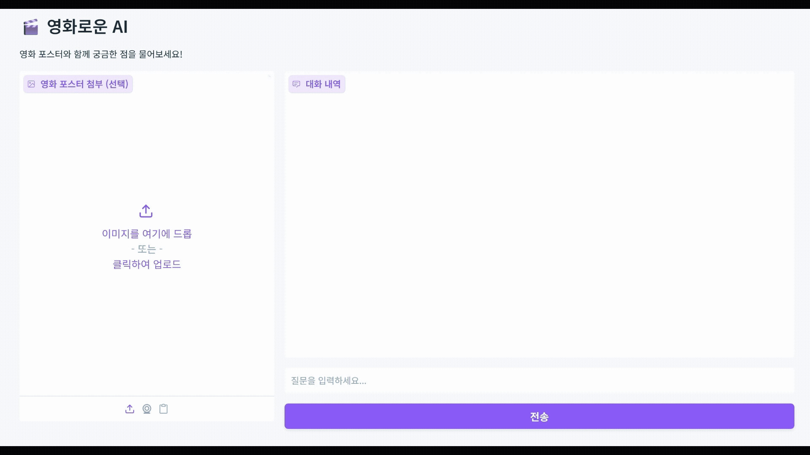

# 🌟 Multimodal Query Pipeline

영화에 대해 뭐든 물어볼 수 있는 챗봇입니다.

질문 유형을 AI가 자동으로 판단해서  
**SQL / Pandas / RAG / VLM** 네 가지 처리 방식 중 하나로 분기됩니다.

<br>

## 🗺️ Architecture



````

<br>

## 🛠️ Tech Stack

| 구분      | 사용 기술                              |
| --------- | -------------------------------------- |
| Backend   | FastAPI                                |
| Frontend  | Gradio                                 |
| LLM       | Gemini 2.5 Flash                       |
| Embedding | paraphrase-multilingual-MiniLM-L12-v2  |
| Vector DB | FAISS                                  |
| Data      | SQLite, CSV, 영화 줄거리 텍스트 (16편) |

<br>

## ✔️ Getting Started

### 1. 환경 설정

```bash
pip install -r requirements.txt
````

`.env` 파일 생성:

```
GEMINI_API_KEY=your_api_key_here
```

### 2. 백엔드 실행

```bash
python -m uvicorn app.main:app --reload
```

### 3. 프론트엔드 실행

```bash
python frontend/app.py
```

<br>

## 🎥 Demo

### 1. SQL — 영화 목록, 감독, 출연진 조회

- 크리스토퍼 놀란 감독 영화 목록 알려줘.
- 액션 장르 영화 다 보여줘.
- 톰 크루즈 출연 영화 뭐 있어?



### 2. Pandas — 통계, 순위, 흥행 분석

- 평점 가장 높은 영화 TOP 5 알려줘.
- 장르별 평균 평점 계산해줘.



### 3. RAG — 줄거리, 내용, 배경 설명

- 인터스텔라 줄거리 알려줘.
- 어벤져스 배경 설명해줘.



### 4. VLM — 이미지(포스터) 분석

- (영화 포스터 이미지 첨부) 이 영화 뭐야?
- (영화 포스터 이미지 첨부) 이 영화 장르가 뭐야?


